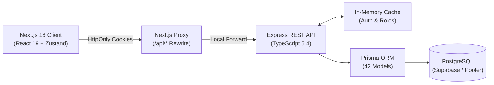

# TripTrails — Travel ERP, CRM & Accounting Platform

[](https://www.typescriptlang.org/)
[](https://nextjs.org/)
[](https://react.dev/)
[](https://nodejs.org/)
[](https://expressjs.com/)
[](https://www.postgresql.org/)
[](https://www.prisma.io/)
[](https://tailwindcss.com/)
[](tests/)

**TripTrails** is a full-stack enterprise management system designed for travel agencies, tour operators, and DMCs. It replaces disconnected spreadsheets, CRM tools, and generic bookkeeping apps by uniting the entire agency lifecycle—from initial lead intake and complex multi-service bookings to automated double-entry general ledger accounting.

---

## 🎯 What It Does

```text
  [Inbound Lead] ──> [Dynamic Quote] ──> [Confirmed Booking] ──> [Automated Invoicing]
                                                                          │
                                                                          ▼
                                                              [Balanced General Ledger]
                                                              (Debits == Credits Audit)
```

* **Lead & CRM Management**: Inbound intake, qualification pipelines, activity logs, and one-click conversion to bookings.
* **Travel Operations**: Multi-service bookings (flights, hotels, tours, visas) with live supplier cost tracking and margin calculations.
* **Client-Side Document Engine**: Real-time PDF rendering for invoices, receipts, and quotations directly in the browser via `@react-pdf/renderer` (zero server memory footprint).
* **Automated Accounting**: Double-entry journal postings generated automatically upon invoice creation, supporting Tour Operators Margin Scheme (`VAT_ON_MARGIN`), standard VAT, and automated reversal journals for cancellations.
* **Multi-Branch & Multi-Currency**: Role-based access control (`admin`, `manager`, `agent`, `accountant`) with branch-level isolation and head-office consolidation.

---

## 🛠 Tech Stack

| Layer | Technology | Key Highlights |
| :--- | :--- | :--- |
| **Frontend** | Next.js 16.2 (App Router), React 19.2 | Tailwind CSS v4, Radix UI primitives, Lucide icons, Dark/Light theme |
| **State & Data** | Zustand 5.0, TanStack Query v5, TanStack Table v8 | Client state persistence, offline query cache, fast headless data tables |
| **Backend** | Node.js, Express 4.19, TypeScript | Layered controller/service pattern, centralized error & response handling |
| **Database** | PostgreSQL 15+, Prisma ORM 5.14+ | 42 relational models, foreign key constraints, connection pooling |
| **Security** | JWT (HttpOnly Cookies), Bcrypt, Helmet, Rate Limit | Same-origin cookie auth, token revocation blacklist, in-memory session cache |
| **Validation** | Zod (Client & Server) | Strict end-to-end schema validation with declarative error mapping |

---

## 🏗 System Architecture



---

## 💡 Key Engineering Challenges & Solutions

* **Double-Entry Journal Balancing for Zero & Negative Margins**:
  * *Problem*: In travel, discounted packages can yield zero or negative margins. Standard VAT calculations generate unbalanced debit/credit entries.
  * *Solution*: Built conditional accounting branching: zero-margin services are treated as pure pass-throughs; negative margins automatically debit **Account 5000 (Cost Variance)**, ensuring $\sum \text{Debits} == \sum \text{Credits}$ at all times.
* **High-Latency Cloud Database Overhead**:
  * *Problem*: Remote Supabase connection latency (~105ms RTT) was exacerbated by running redundant session setup queries on every request.
  * *Solution*: Eliminated no-op connection-pool session commands and implemented a 60-second in-memory session cache in `authMiddleware`, cutting repeated request authentication overhead from ~560ms to **< 1ms**.
* **Elimination of Next.js Route Compilation Cascades**:
  * *Problem*: Next.js App Router default viewport prefetching triggered 90+ concurrent compile requests on page load in dev mode.
  * *Solution*: Applied selective `prefetch={false}` across fixed navigation components, reducing initial background network traffic by over 80%.
* **Concurrency Protection on Invoicing**:
  * *Problem*: Double-clicking invoice generation risked creating duplicate commercial invoices and duplicate journal entries.
  * *Solution*: Added active-invoice validation raising an explicit `409 Conflict` if a non-cancelled invoice already exists for the booking.

---

## 🧪 Testing & Quality Assurance

Automated integration test runner executing 5 critical P0 test suites sequentially:

```bash
cd travelflow-backend
npm run test
```

```text
════════════════════════════════════════════════════════════
             RUNNING ALL P0 BACKEND REGRESSION TESTS        
════════════════════════════════════════════════════════════
✔ P0.1: Security — Credential & Password Sanitization      (4/4 passed)
✔ P0.2: Expense Accounting & Audit Trail                   (4/4 passed)
✔ P0.3: Zero / Negative Margin Invoice Balancing           (4/4 passed)
✔ P0.4: Quantity & Pricing Single Source of Truth          (4/4 passed)
✔ P0.5: Duplicate Invoice Prevention & Reversal Journals   (3/3 passed)
────────────────────────────────────────────────────────────
Total: 19/19 passed (100%)
```

---

## ⚡ Quickstart

### Prerequisites
* **Node.js**: `v20+` | **npm**: `v10+` | **PostgreSQL**: `v15+` (or Supabase)

### 1. Backend Setup
```bash
cd travelflow-backend
npm install
cp .env.example .env

# Push schema, seed core data (Agency, Branch, Admin, COA), and run tests
npx prisma db push
npm run seed
npm run test

# Start API server on http://localhost:5000
npm run dev
```

### 2. Frontend Setup
```bash
cd ../travelflow-frontend
npm install
cp .env.example .env.local

# Start Next.js client on http://localhost:3000
npm run dev
```

---

## 🔐 Environment Variables

| Variable | Scope | Purpose |
| :--- | :--- | :--- |
| `DATABASE_URL` | Backend | PostgreSQL connection string (direct or pooled) |
| `DIRECT_URL` | Backend | Direct connection string for Prisma migrations |
| `JWT_SECRET` | Backend | Minimum 64-character key for signing access tokens |
| `JWT_REFRESH_SECRET`| Backend | Minimum 64-character key for signing refresh tokens |
| `BACKEND_URL` | Frontend | Target backend URL for Next.js proxy rewrites (`http://127.0.0.1:5000`) |
| `NEXT_PUBLIC_USE_API` | Frontend | Set to `true` to use live backend API (`false` for offline mock) |

---

## 📸 Interface Preview

| Operations & CRM | Double-Entry Accounting |
| :---: | :---: |
| *Lead pipelines, multi-service bookings, passenger details, and supplier reconciliation.* | *Interactive Chart of Accounts, General Ledger, balanced journals, and Balance Sheet.* |

| Multi-Version Quotations | PDF Invoicing & Receipts |
| :---: | :---: |
| *Draft, versioned, and accepted proposals convertible to bookings in 1-click.* | *Browser-rendered tax invoices with margin-scheme VAT calculation.* |

---

## 👨‍💻 Developer & Contact

**Khubaib Shah**  
*Full-Stack Software Engineer*

* **GitHub**: [@Khubaib-shah](https://github.com/Khubaib-shah)
* **Repository**: [TripTrails / TravelFlow](https://github.com/Khubaib-shah/TravelFlow)
* **Email**: `bewithbaacha@gmail.com`
